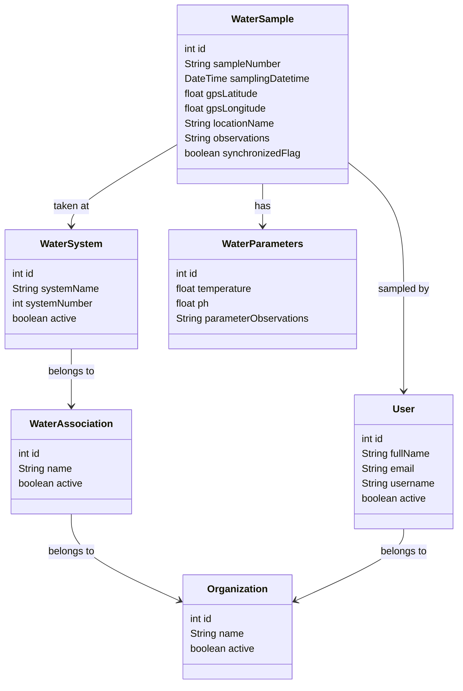

# 🚰 AquaInspector

Una aplicación móvil desarrollada en Flutter para la gestión integral de muestras de agua en sistemas de acueductos y asociaciones de agua.


## 📋 Descripción

AquaInspector es una solución completa para técnicos, inspectores y organizaciones encargadas del control de calidad del agua en acueductos. La aplicación permite gestionar desde la toma de muestras hasta el análisis de parámetros fisicoquímicos, proporcionando una herramienta digital robusta para reemplazar los procesos manuales tradicionales.

## ✨ Características Principales

### 🎯 Funcionalidades Actuales
- **🔐 Autenticación de usuarios** - Sistema de login seguro
- **🏠 Dashboard principal** - Pantalla de inicio con navegación intuitiva
- **📱 Interfaz responsiva** - Diseño adaptado para diferentes dispositivos
- **🎨 UI/UX moderno** - Interfaz limpia con gradientes y componentes personalizados

### 🚀 Funcionalidades Planificadas
- **📍 Geolocalización GPS** - Registro automático de coordenadas de muestreo
- **🧪 Registro de parámetros** - Medición de pH, temperatura y otros parámetros
- **📊 Base de datos local** - Almacenamiento offline con sincronización
- **👥 Gestión multiusuario** - Diferentes roles y permisos
- **🏢 Gestión organizacional** - Manejo de asociaciones y sistemas de agua
- **📈 Reportes y análisis** - Generación automática de informes

## 🗄️ Modelo de Datos

El proyecto incluye un modelo de datos completo definido en `clases.mermaid`:



## 🏗️ Arquitectura del Proyecto

```
lib/
├── main.dart                  # Punto de entrada de la aplicación
├── login_screen.dart          # Pantalla de autenticación
├── home_screen.dart           # Dashboard principal
├── custom_button_menu.dart    # Componente de botón personalizado
├── models/                    # Modelos de datos
└── screens/                   # Pantallas adicionales
assets/
├── images/                    # Recursos gráficos
│   └── logo.png              # Logo de la aplicación
└── icons/                     # Iconos personalizados
```

## 🚀 Instalación y Configuración

### Prerrequisitos

- Flutter SDK 3.8.1 o superior
- Dart SDK 3.8.1 o superior
- Android Studio / VS Code
- Git

### Instalación

1. **Clonar el repositorio**

   ```bash
   git clone <url-del-repositorio>
   cd aqua_inspector
   ```

2. **Instalar dependencias**

   ```bash
   flutter pub get
   ```

3. **Verificar la instalación**

   ```bash
   flutter doctor
   ```

4. **Ejecutar la aplicación**

   ```bash
   flutter run
   ```

## 📱 Capturas de Pantalla

## 🛠️ Tecnologías y Dependencias

### Framework Principal
- **Flutter**: ^3.8.1
- **Dart**: ^3.8.1

### Dependencias Principales
- `cupertino_icons`: ^1.0.8 - Iconos iOS

### Dependencias de Desarrollo
- `flutter_test`: Testing framework
- `flutter_lints`: ^5.0.0 - Reglas de código


## 📂 Estructura de Datos

### Entidades Principales

1. **Organizaciones** - Entidades gestoras del agua
2. **Asociaciones de Agua** - Grupos específicos dentro de organizaciones
3. **Sistemas de Agua** - Infraestructuras específicas de distribución
4. **Usuarios** - Personal técnico y administrativo
5. **Muestras de Agua** - Registros de toma de muestras
6. **Parámetros** - Mediciones fisicoquímicas

## 📄 Licencia

Este proyecto está bajo la licencia MIT. Consulta el archivo `LICENSE` para más detalles.

## 📞 Contacto

**Proyecto**: AquaInspector  
**Versión**: 0.0.1  
**Estado**: En desarrollo activo

---
